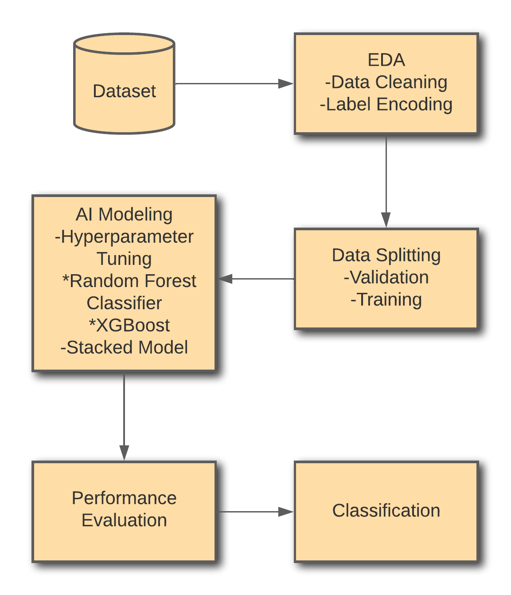
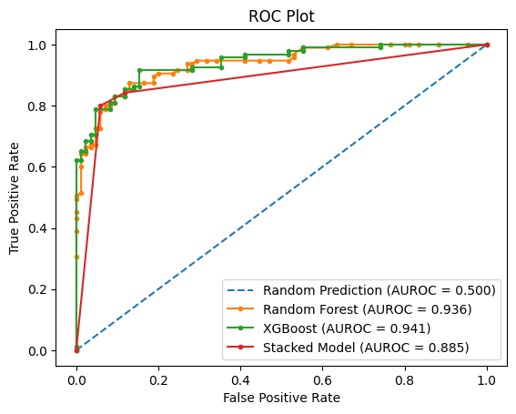

# Raisin Grains Prediction Using Stacked Ensemble Modeling of Random Forest and XGBoost Classification Models

    

## Overview
Raisins are manufactured by drying various grape varieties in the sun. Raisins are one of the healthiest foods since they are high in carbs, antioxidants, potassium, fiber, and iron, and studies have shown that they help reduce the risk of heart disease by lowering blood pressure and blood sugar levels. Turkey is one of the world's leading grape producers, with 37% of grapes being dried to manufacture raisins. Different sorts of raisins can be made using several grape species. In Turkey, two types of raisins are grown: Kecimen and Besni. There are a variety of methods for classifying raisins, most of them are traditional, meaning they are based on human actions or procedures. These traditional process of classifying is meticulous and is very tiresome causing fatigue among workers and causing incosistencies in product classification. These unpleasant scenarios and issues are the driving forces behind the development of alternative ways for evaluating the fundamental characteristics of items like raisins efficiently and precisely.

## Methodology

  

#### Data Gathering and Dataset Preparation
The [dataset](https://www.kaggle.com/datasets/muratkokludataset/raisin-dataset) contains 900 rows (450 Kecimen and 450 Besni), as well as 8 column features in which 7 features (Area, Perimeter, MajorAxisLength, MinorAxisLength, Eccentricity, ConvexArea, Extent) are morphological are then used for determining the Class. This dataset is specifically used for classifying raisins into Kecimen and Besni.
#### Data Preprocessing
Exploratory Data Analysis was conducted. In the data prerprocessing phase the dataset is examined and gather an overview of the contents being used this gives the range of entries, columns, non-null counts, and datatypes of the dataset. This phase also includes data cleaning, label encoding and data normalization.
#### Data Cleaning
In the dataset overview it has presented that there are no missing values therefore the dataset used does not require removing or filling of data as well as fixing for outliers and missing data.
#### Label Encoding
Label encoding is the process of translating text or string valued data into numerical data. This step was important in the data preprocessing to replace the string values in the Class column since Kecimen and Besni are used to classify them label encoding was used to replace this values to 0 and 1 respectively.
#### Data Splitting
The dataset contains 900 rows (450 Kecimen and 450 Besni). The data is split into training and validation to be used for the models. Eighty percent (80%) or 720 of the data was used for training while the twenty percent (20%) 180 of the data was used for validation. Since there are two classes or labels, the selection of data must be equal.
#### AI Modeling
The creation of the model used for the final classification prediction will utilize base classifiers and a stacked model. Along with using based classifiers and a stacked model these classifiers and stacked model must be tuned accordingly to best fit the model data and avoid overfitting.
#### Hyperparameter Tuning
Optimal model architecture of the models being used must be obtained to enable the input data to be transformed into the desired output. Hyperparameter tuning was done on the two base classifiers and stacked model to define the structure of the desired model. This procedure was done using RandomizedSearchCV.
#### Machine Learning Models
two base classifiers was used for making the stacked ensemble model. The first classifier used was the Random Forest (RF) is a supervised classification algorithm and is a decision tree made up of numerous different decisions trees. There is a direct link between the result and the cost. The forest's total amount of trees. The more trees there are, the better. the more precise the results will be. The second classifier used was the Extreme Gradient Boosting (XGBoost) is a decision-tree-based ensemble machine learning algorithm. The gradient boosting framework makes use of this. In decision trees, in their most basic form, they are simple to visualize and interpret.

#### Performance Evaluation
To assess how the models and stacked models work a metric specifically four different criteria was used to evaluate its performance. The models will be assessed based on Accuracy, Precision, Recall and F1-Score.

## Results and Conclusion

#### Test Evaluation

| Models                   | Accuracy  | Precision | Recall | F1-Score |
|:-------------------------|:---------:|:---------:|:------:|:--------:|
| Random Forest Classifier |   86.67   |   87.02   |  86.87 |  86.67   |
| XG Boost Classifier      |   86.11   |   86.75   |  86.11 |  86.11   |
| Stacked Model            |   86.11   |   86.11   |  86.11 |  86.11   |

#### Confusion Matrix

| Models                   | TP | TN | FP  | FN |
|:-------------------------|:--:|:--:|:---:|:--:|
| Random Forest Classifier | 79 | 77 | 8   | 16 |
| XG Boost Classifier      | 77 | 78 | 7   | 18 |
| Stacked Model            | 80 | 75 | 10  | 15 |

#### ROC Curve

    

#### Predictions Test
|                       | Actual | Predicted_RandomForest | Predicted_XGBoost  | Predicted_Stacked |
|:---------------------:|:------:|:----------------------:|:------------------:|:-----------------:|
| 398                   | 0      | 0                      | 1                  | 1                 |
| 349                   | 0      | 1                      | 0                  | 0                 |
| 232                   | 0      | 1                      | 1                  | 1                 |
| 843                   | 1      | 1                      | 1                  | 1                 |
| 819                   | 1      | 1                      | 1                  | 1                 |
| 736                   | 1      | 1                      | 1                  | 1                 |
| 777                   | 1      | 1                      | 1                  | 1                 |
| 636                   | 1      | 1                      | 1                  | 1                 |
| 768                   | 1      | 1                      | 1                  | 1                 |
| 832                   | 1      | 0                      | 0                  | 0                 |
| 722                   | 1      | 1                      | 1                  | 1                 |
| 376                   | 0      | 0                      | 0                  | 0                 |
| 217                   | 0      | 0                      | 0                  | 0                 |
| 87                    | 0      | 0                      | 0                  | 0                 |
| 823                   | 1      | 1                      | 1                  | 1                 |
| 528                   | 1      | 1                      | 1                  | 1                 |
| 46                    | 0      | 0                      | 0                  | 0                 |
| 134                   | 0      | 0                      | 0                  | 0                 |
| 664                   | 1      | 1                      | 1                  | 1                 |
| 597                   | 1      | 1                      | 1                  | 1                 |

Two base classifiers (Random Forest and XGBoost) and the stacked model's performance was evaluated to classify raisins grains into Kecimen or Besni according to its features. The models were assessed in terms of Accuracy, Precision, Recall and F1-score and a confusion matrix were used as performance evaluation. The model that attained the highest score across all the metrics presented is the Random Forest Classifier with an Accuracy of 86.67%, Precision of 87.02%, Recall of 86.85% and F1-Score of 86.67% and the two other models are not far behind. Overall, all the models performed well ultimately leading to prediction test in which an evaluation of 20 predictions were tested, the models achieved accuracy in 17 cases, correctly identifying both positive and negative instances. However, they also produced 3 incorrect predictions, including instances of both false positives and false negatives.

